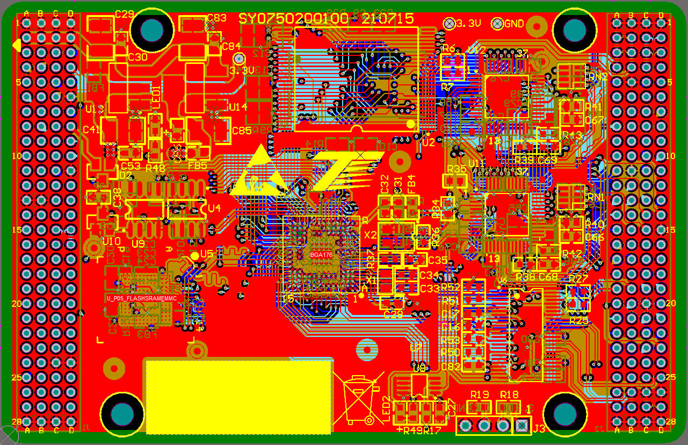

# 标准化核心板 SWOS2 bsp 说明

## 简介

本文档为 思维研究院 开发团队为标准化核心板提供的 bsp (board support package 板级支持包) 说明。

主要内容如下：

- 标准化核心板资源介绍
- 快速上手
- 进阶使用方法

通过阅读快速上手章节开发者可以快速地上手该 bsp，将 SWOS2 (基于RT-Thread实时内核) 运行在标准化核心板上。在进阶使用指南章节，将会介绍更多高级功能，帮助开发者驱动更多板载资源。

## 标准化核心板介绍

标准化核心板 是思维研究院推出的一款基于 类stm32 MCU 的核心板，支持多种MCU进行切换使用，该核心板具有丰富的板载资源，可以充分发挥MCU的芯片性能。

核心板外观如下图所示：



该开发板常用 **板载资源** 如下：

- MCU：

| 型号 | 主频 | FLASH | RAM |
| ------------ | ------------ | ------------ | ------------ |
| stm32f103cb | 72MHz | 128KB | 20KB |
| stm32f427zg | 180MHz | 2048KB | 256KB |
| gd32f427zg | 180MHz | 2048KB | 256KB |
| stm32f429ii | 180MHz | 2048KB | 256KB |
| stm32f437ii | 180MHz | 2048KB | 256KB |
| gd32f450ii | 200MHz | 2048KB | 256KB |
| stm32h743ii | 480MHz | 2048KB | 1024KB |

- 外部 RAM：CY7C1051DV33-10ZSXI（SRAM）、MT48LC16M16A2P-6A（SDRAM）
- 外部 FLASH：FM25V10-GTR（SPI，fram）、MT28EW01GABA1LJS（NOR）、MTFC4GMWDM-3M AIT A（EMMC）
- 常用外设
  - LED：1个
  - RTC
- 常用接口：
  - USB HS：usb host，u盘设备驱动支持
  - 以太网：2个，KSZ8851-16MLLU（FMC）
  - CAN：2个，CAN1，CAN2
  - UART
  - SPI
  - I2C
- 调试接口
  - 标准 SWD
  - USB 转串口：用于msh shell调试

## 外设支持

本 BSP 目前对外设的支持情况如下：

| **板载外设**      | **支持情况** | **备注**                              |
| :----------------- | :----------: | :------------------------------------- |
| 以太网            |     支持     |  支持 KSZ8851-16MLLU 双网口                                 |
| SRAM             |     支持     |                                       |
| SDRAM             |     支持     |                                       |
| CAN               |   支持   |                                        |
| RS485               |   支持   |                                  |
| NOR               |   支持   |                                 |
| EMMC               |   支持   |                                 |
| FRAM               |   支持   |  支持 FM25xx 系列芯片  |
| SPIFLASH               |   支持   |  支持 sfud 系列芯片  |
| EEPROM               |   支持   |                                 |
| **片上外设**      | **支持情况** | **备注**                              |
| GPIO              |     支持     |                                     |
| UART              |     支持     |                               |
| SPI               |     支持     | 软件 SPI 或 硬件 SPI                     |
| I2C               |     支持     | 软件 I2C 或 硬件 I2C                            |
| CAN               |     支持     |                                    |
| RTC               |     支持     | 支持外部晶振和内部低速时钟 |
| WDT               |     支持     |                                       |
| FLASH | 支持 | 已适配 FAL (Flash Abstraction Layer) Flash 抽象层 |
| USB Device        |   不支持   |                               |
| USB Host          |   支持   | 支持挂载FAT16、FAT32、exFAT文件系统的u盘设备 |
| **第三方库**      | **支持情况** | **备注**                              |
| syswatch        |   支持   |                               |
| FS | 支持 | 已适配 DFS（Device File System） 设备虚拟文件系统 |
| CMSIS_5        |   支持   |                               |
| crclib        |   支持   |                               |
| ota_downloader        |   支持   |   支持bootloader   |
| ota_fram_file        |   支持   |  支持通过文件升级程序  |
| CherryUSB        |   支持   |                               |
| STM32USB        |   支持   |                               |
| qboot        |   支持   |  支持bootloader引导程序  |
| littlefs        |   支持   |  支持均衡写入和掉电保护的文件系统  |
| netutils        |   支持   |                               |
| FlashDB        |   支持   |   支持键值对数据库   |
| helix        |   支持   |   支持mp3文件解码   |
| vi        |   支持   |   支持文本文件编辑   |
| ulog_back        |   支持   |  支持将log输出至日志文件     ||

## 使用说明

使用说明分为如下两个章节：

- 快速上手

    本章节是为刚接触 RT-Thread 的新手准备的使用说明，遵循简单的步骤即可将 RT-Thread 操作系统运行在该开发板上，看到实验效果 。

- 进阶使用

    本章节是为需要在 RT-Thread 操作系统上使用更多开发板资源的开发者准备的。通过使用 ENV 工具对 BSP 进行配置，可以开启更多板载资源，实现更多高级功能。


### 快速上手

本 BSP 为开发者提供RT-Thread Studio、MDK4、MDK5 和 IAR 工程，并且支持 GCC 开发环境。

#### mdk5工程

在当前目录打开env工具，执行命令mkproject.bat
- 源码工程：双击打开project.uvprojx
- lib库工程：进入swos2_lib文件夹，双击打开project.uvprojx
  - swos2_lib文件夹内包含了工程所需的所有头文件与lib库
  - 本工程为swos2最小系统，直接编译即可使用。后续可自行添加应用代码

下面以 RT-Thread Studio 开发环境为例，介绍如何将系统运行起来。

#### 硬件连接

使用数据线连接开发板到 PC，打开电源开关。

#### 编译下载

点击 文件->导入->RT-Thread Studio项目到工作空间中，点击RT-Thread Setting对bsp进行裁剪，点击编译并下载程序到开发板。

> 工程默认配置使用 STlink 下载程序，在通过 STlink 连接开发板的基础上，点击下载按钮即可下载程序到开发板

#### 运行结果

下载程序成功之后，系统会自动运行，观察开发板上 LED 的运行效果，黄色 LED 会周期性闪烁。

连接开发板对应串口到 PC , 在终端工具里打开相应的串口（115200-8-1-N），复位设备后，可以看到 RT-Thread 的输出信息:

```bash
'  ######  ##      ##  #######   ######   #######   
' ##    ## ##  ##  ## ##     ## ##    ## ##     ##  
' ##       ##  ##  ## ##     ## ##              ##  
'  ######  ##  ##  ## ##     ##  ######   #######   
'       ## ##  ##  ## ##     ##       ## ##         
'       ## ##  ##  ## ##     ##       ## ##         
' ##    ## ##  ##  ## ##     ## ##    ## ##         
'  ######   ###  ###   #######   ######  #########  
'                           Thread Operating System
'                  4.1.1 build Feb 20 2023 10:22:10
'                              Powered by RT-Thread
'           2006 - 2023 Copyright by hnthinker team

msh />
```
### 进阶使用

此 BSP 默认只开启了 LED 和 调试串口 的功能，如果需使用 SRAM、Flash 等更多高级功能，需要利用 ENV 工具对BSP 进行配置，步骤如下：

1. 在 bsp 下打开 env 工具。

2. 输入`menuconfig`命令配置工程，配置好之后保存退出。

3. 输入`pkgs --update`命令更新软件包。

4. 输入`scons --target=mdk4/mdk5/iar` 命令重新生成工程。

## 注意事项

暂无

## 联系人信息

维护人:

- 思维研究院 吕晗 13526496196